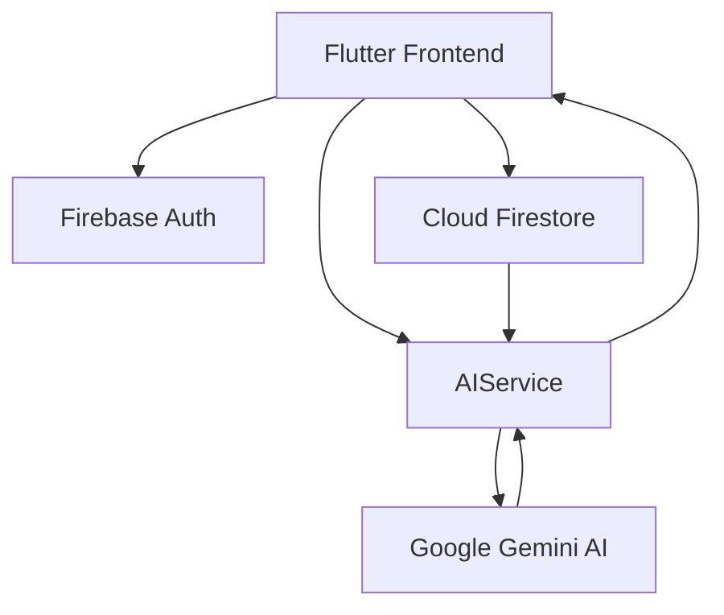

# 💸 AI Finance Manager
### *Your personal financial advisor, powered by Google Gemini.*

---

## 📸 App Screenshots

<div align="center">
  
</div>

---

## 🌟 Key Features & Highlights

### 🧠 **AI Smart Tips**
Leverages Google Gemini to provide contextual, hyper-personalized advice based on your current financial health. Instead of generic advice, you get actionable insights directly relevant to your daily spending, income, and debt.

### 💳 **Smart Savings & Card Recommendations**
Analyzes your spending patterns and suggests the specific credit cards that would maximize your rewards. For example, it won't just track your food expenses; it will recommend a card that could save you money on those exact transactions.

### 📈 **AI Investment Planning**
Calculates your real-time net savings (Income - Expenses - EMIs) and provides a tailored investment strategy. It categorizes investments by risk (High, Medium, Low Risk) and suggests specific allocations across Stocks, SIPs, and ETFs based on your net savings percentage.

### 📊 **Real-Time Portfolio Tracking**
A comprehensive dashboard to track your investments, monitor growth, and see your overall current value versus total invested amount.

---

## 💡 How It Works

AI Finance Manager is an AI-first mobile application that transforms raw financial data into a personalized wealth-building strategy. 
- **Active Advisor**: Instead of just showing *what* you spent, we show you *how* to spend better.
- **Contextual Intelligence**: Using Gemini AI to bridge the gap between logging a transaction and building a robust financial portfolio.

---

## ⚙️ Technical & Visual Assets

### **Architecture Diagram**


### **Technologies Used**
- **Core**: Flutter, Dart
- **AI Engine**: Google Gemini AI (via `google_generative_ai`)
- **Backend/Cloud**: Firebase Auth, Cloud Firestore
- **State Management**: Provider
- **Visualization**: fl_chart, Lucide Icons, Google Fonts

---

## 🚀 Getting Started & Security

> [!IMPORTANT]
> **Security Warning**: Never commit your real API keys to GitHub. Use environment variables or local configuration files that are ignored by git.

### **Setup Instructions**
1. **Clone the repository**:
   ```bash
   git clone <your-repository-url>
   ```
2. **Install dependencies**:
   ```bash
   flutter pub get
   ```
3. **Configure Firebase**:
   - Add your `google-services.json` (Android) and `GoogleService-Info.plist` (iOS) to the respective directories.
4. **Add Gemini API Key**:
   - Obtain a key from [Google AI Studio](https://aistudio.google.com/).
   - Update the `_apiKey` in `lib/services/ai_service.dart`.
5. **Run the app**:
   ```bash
   flutter run
   ```

---

## 🛣 Future Roadmap
- [ ] Automated SMS expense parsing.
- [ ] Multi-currency support.
- [ ] Real-time stock market tracking.

---

### **Project Links**
- **GitHub Repository**: [Link]
- **Demo Video**: [Link]

---

Developed with ❤️ for the future of Personal Finance.
