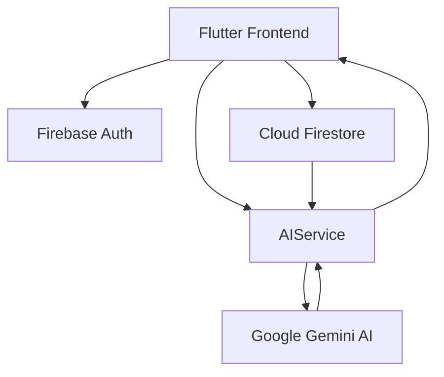

# 💸 AI Finance Manager
### *Your personal financial advisor, powered by Google Gemini.*

---

## 👥 Team & Problem Details

- **Team Name**: [ENTER_TEAM_NAME]
- **Team Leader Name**: [ENTER_NAME]
- **Problem Statement**: Most personal finance apps are passive "record-keepers" rather than active "advisors." Users often log their expenses but fail to understand *how* to optimize their spending, which credit cards offer the best value for their specific habits, or how to start investing based on their actual savings. There is a massive gap between data collection and financial wisdom.

---

## 💡 Solution & Business Logic

### **Solution Brief**
AI Finance Manager is an AI-first mobile application that transforms raw financial data into a personalized wealth-building strategy. By leveraging **Google Gemini AI**, the app analyzes spending patterns, debt obligations (EMIs), and income to provide hyper-personalized "Smart Tips," investment plans, and card recommendations that save users real money.

### **Market Differentiation**
- **Passive vs. Active**: Traditional apps show you *what* you spent; we show you *how* to spend better.
- **Monetized Insights**: We don't just say "you spend too much on food." We suggest the specific credit card (e.g., Swiggy HDFC) that would have saved you ₹500 on those exact transactions.
- **Contextual Investing**: Investment suggestions are calculated based on your *real-time* net savings (Income - Expenses - EMIs).

### **USP (Unique Selling Proposition)**
> **"The Financial Brain in your Pocket"** — We provide the intelligence of a financial advisor with the convenience of a mobile tracker, using Gemini to bridge the gap between logging a transaction and building a portfolio.

---

## ⚙️ Technical & Visual Assets

### **Architecture Diagram**


### **Technologies Used**
- **Core**: Flutter, Dart
- **AI Engine**: Google Gemini AI (via `google_generative_ai`)
- **Backend/Cloud**: Firebase Auth, Cloud Firestore
- **State Management**: Provider
- **Visualization**: fl_chart, Lucide Icons, Google Fonts

---

## 🚀 Getting Started & Security

> [!IMPORTANT]
> **Security Warning**: Never commit your real API keys to GitHub. Use environment variables or local configuration files that are ignored by git.

### **Setup Instructions**
1. **Clone the repository**:
   ```bash
   git clone <your-repository-url>
   ```
2. **Install dependencies**:
   ```bash
   flutter pub get
   ```
3. **Configure Firebase**:
   - Add your `google-services.json` (Android) and `GoogleService-Info.plist` (iOS) to the respective directories.
4. **Add Gemini API Key**:
   - Obtain a key from [Google AI Studio](https://aistudio.google.com/).
   - Update the `_apiKey` in `lib/services/ai_service.dart`.
5. **Run the app**:
   ```bash
   flutter run
   ```

---

## 🛣 Future Roadmap
- [ ] Automated SMS expense parsing.
- [ ] Multi-currency support.
- [ ] Real-time stock market tracking.

---

### **Project Links**
- **GitHub Repository**: [Link]
- **Demo Video**: [Link]

---

Developed with ❤️ for the future of Personal Finance.
