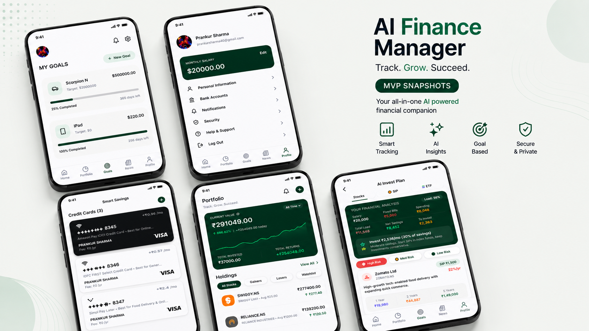
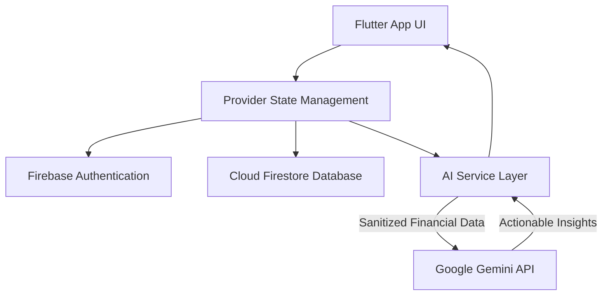

# 💸 AI Finance Manager
### *Your personal financial advisor, powered by Google Gemini.*

---

## 📸 App Screenshots

<div align="center">
  
</div>

---

## 🌟 Key Features & Highlights

### 🧠 **AI Smart Tips**
Leverages Google Gemini to provide contextual, hyper-personalized advice based on your current financial health. Instead of generic advice, you get actionable insights directly relevant to your daily spending, income, and debt.

### 💳 **Smart Savings & Card Recommendations**
Analyzes your spending patterns and suggests the specific credit cards that would maximize your rewards. For example, it won't just track your food expenses; it will recommend a card that could save you money on those exact transactions.

### 📈 **AI Investment Planning**
Calculates your real-time net savings (Income - Expenses - EMIs) and provides a tailored investment strategy. It categorizes investments by risk (High, Medium, Low Risk) and suggests specific allocations across Stocks, SIPs, and ETFs based on your net savings percentage.

### 📊 **Real-Time Portfolio Tracking**
A comprehensive dashboard to track your investments, monitor growth, and see your overall current value versus total invested amount.

---

## 💡 Comprehensive Technical Breakdown & Logic

AI Finance Manager is not just a standard expense tracker; it acts as a proactive financial brain. By combining mobile-first engineering with state-of-the-art Generative AI, it transforms scattered financial data into an actionable, tailored wealth-building plan.

### **1. Core Logic & Data Flow**
At the heart of the application is a rigorous calculation engine that continuously monitors user finances in real-time:
- **Income Logging**: Users log their monthly or variable income streams.
- **Expense & EMI Tracking**: The app categorizes fixed bills, variable spending, and debt obligations (EMIs).
- **Net Savings Calculation**: The application calculates `Real Net Savings = Total Income - (Expenses + Fixed Bills + EMIs)`. This single metric drives the entire intelligent engine.

### **2. Deep Dive: Google Gemini AI API Integration**
The standout feature of this app is its intelligent layer, powered by the **Google Gemini Pro API** (accessed via the `google_generative_ai` Flutter package).
- **Contextual Data Processing**: The app securely packages the user’s sanitized financial context (e.g., spending categories, current debt, savings rate) into a structured prompt.
- **Dynamic Response Parsing**: Gemini doesn't just return generic text. It is instructed to generate highly specific structured data that the app parses to display:
  - **Smart Tips**: Contextual warnings (e.g., *"Your dining expenses are 20% higher than last month; consider cooking at home to save for your ETF goal"*).
  - **Smart Savings & Cards**: By analyzing specific merchant names and categories, the AI maps spending habits to specific financial products (e.g., suggesting a specific co-branded credit card if food delivery spending is high).
  - **Investment Strategist**: Based on the exact percentage of the user's `Net Savings`, Gemini formulates a diversified portfolio plan, categorizing assets into High Risk (direct equities), Medium Risk (Index Funds/SIPs), and Low Risk (FDs/Bonds).

### **3. Backend & Cloud Infrastructure: Firebase APIs**
The entire backend ecosystem relies on **Google Firebase** for scalability, security, and real-time syncing.
- **Firebase Authentication API**: Provides secure, robust user identity management. It ensures that sensitive financial data is strictly tied to the authenticated user's unique UID.
- **Cloud Firestore (NoSQL Database API)**: We use Firestore's real-time document-based structure to store transactions, portfolio holdings, and user profiles. 
  - *Collections*: Transactions are stored in time-indexed collections, allowing for lightning-fast queries (e.g., fetching only "this month's expenses").
  - *Security Rules*: Strict server-side rules guarantee that users can only read and write data explicitly owned by their UID.

### **4. Frontend Architecture & State Management**
Built with **Flutter** for a natively compiled cross-platform experience.
- **State Management (Provider)**: We utilize `Provider` to ensure that when a new transaction is logged, the UI updates instantaneously across the Home Screen, Portfolio, and Analytics dashboards without requiring a full page reload.
- **Data Visualization**: Complex financial data is made digestible using `fl_chart`. We implemented interactive line graphs for portfolio growth tracking and pie charts for expense categorization.
- **Design System**: A premium, dark-mode optimized aesthetic using custom Google Fonts to give the application a professional, trustworthy feel.

---

## ⚙️ Architecture Diagram


---

## 🚀 Getting Started & Security

> [!IMPORTANT]
> **Security Warning**: Never commit your real API keys to GitHub. Use environment variables or local configuration files that are ignored by git.

### **Setup Instructions**
1. **Clone the repository**:
   ```bash
   git clone <your-repository-url>
   ```
2. **Install dependencies**:
   ```bash
   flutter pub get
   ```
3. **Configure Firebase**:
   - Create a project on the Firebase Console.
   - Enable Authentication (Email/Password or Google Sign-In) and Firestore.
   - Download and add `google-services.json` (Android) and `GoogleService-Info.plist` (iOS) to the respective directories.
4. **Add Gemini API Key**:
   - Obtain a key from [Google AI Studio](https://aistudio.google.com/).
   - Update the `_apiKey` variable in `lib/services/ai_service.dart`.
5. **Run the app**:
   ```bash
   flutter run
   ```

---

Developed with ❤️ for the future of Personal Finance.
